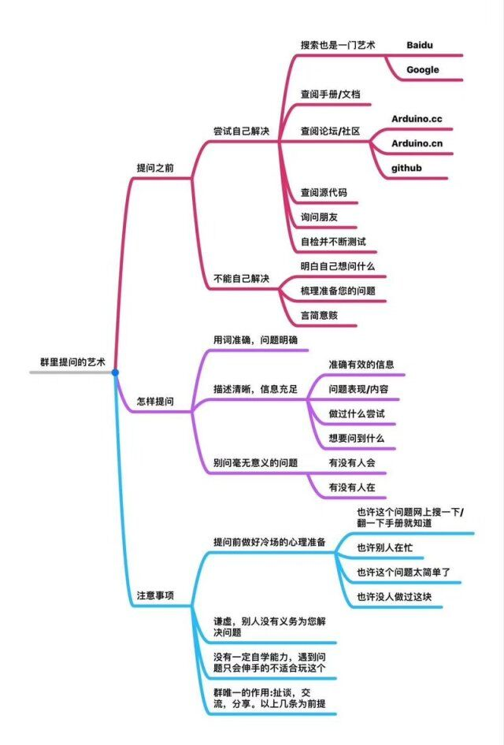
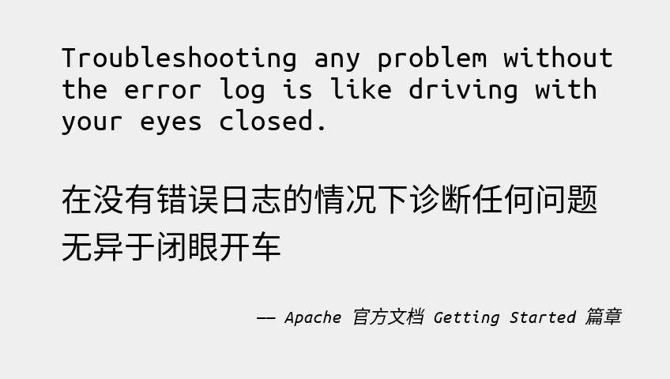
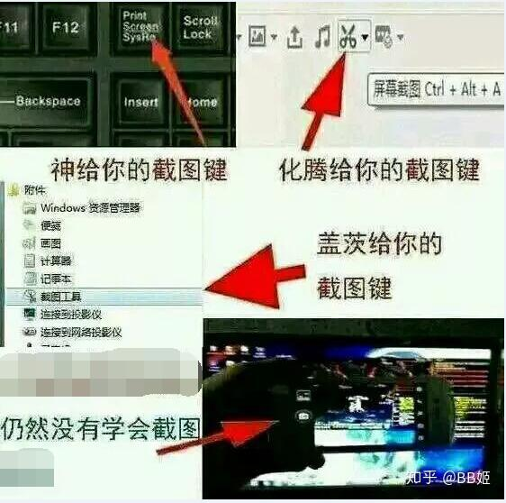
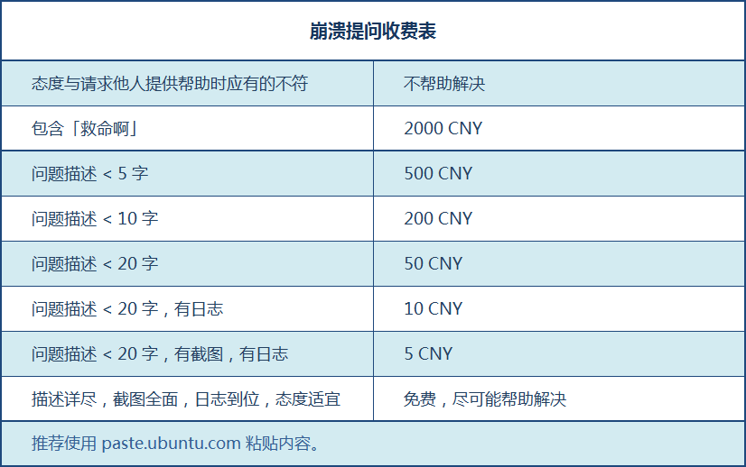
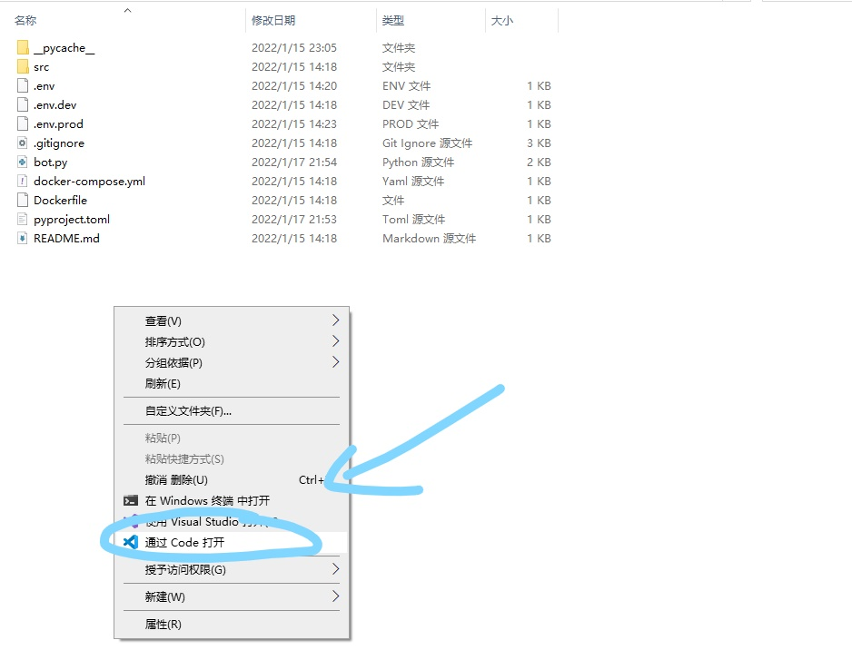
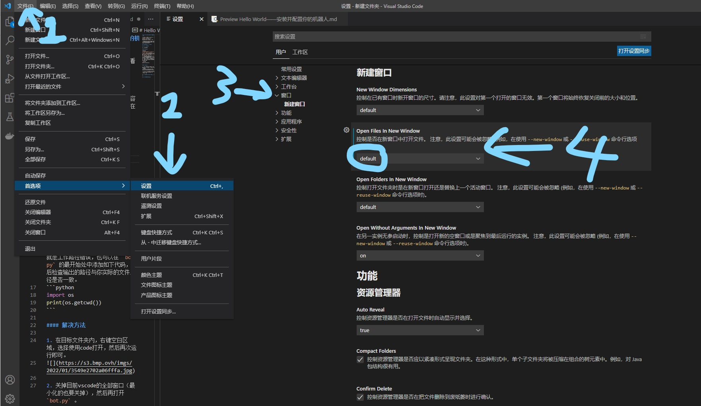
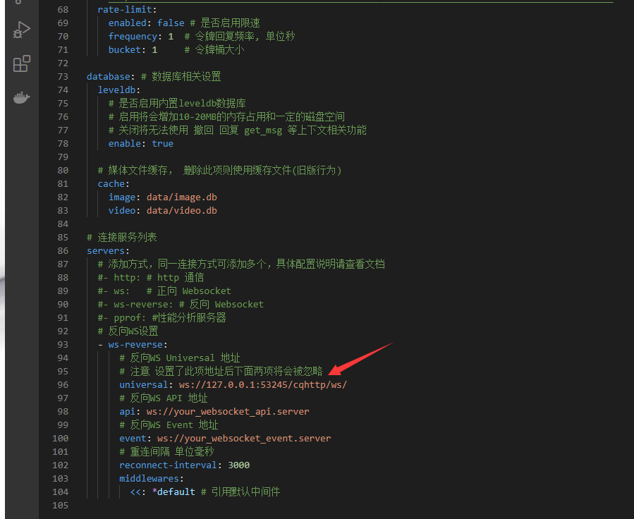

# Hello World——安装并配置你的机器人及常见报错的解决方法

由于环境安装的内容较为抽象，安装的步骤较为繁琐，建议观看[视频教程](https://www.bilibili.com/video/BV1aZ4y1f7e2)。本节将会着重介绍常见错误的解决方法。

本章节仅会针对视频中未指出的内容进行补充与拓展，将不会重复已经在视频中提及的内容。

## 如果你需要提问，请看这里
首先，你需要知道的是，这是个开源项目，这篇文章是你免费观看的，nonebot群是你免费加的，没有任何一个开发者和回答问题的人从你这拿走了一分钱。所以，没人对你负有责任，也没人对你有回答问题的义务。

所有人都从新手过来的，自然也不会无理由拒绝一个新人的提问，不过你的态度和提问方法决定了你的提问成功率，所以我在此不负责任的提供一些提高提问成功率的方法：

0. **最重要**的是**端正你的态度**，用相对温和的方式进行提问，富有耐心。
1. 妥善保留 **问题发生时** 的nonebot日志以及gocq日志，要能清晰的看到错误信息，如果不知道哪里是错误信息就全都保留下来。
2. 使用qq截图 (<kbd>Ctrl</kbd>+<kbd>Alt</kbd>+<kbd>A</kbd>) 或Windows自带的截图 (<kbd>Win</kbd>+<kbd>PrtSc</kbd>) 或其他截图工具进行截图，切勿使用手机拍屏
3. 尽量详细的描述是什么样的问题，而不是“大佬我这机器人出错了”就完了。

### 错误的提问
1. 救命啊大佬我这个机器人没反应怎么办啊？（同时不提供任何其他说明和信息）
> 没有提供日志和截图、也没有详细的描述

2. 这群里没个活人吗，我这机器人打不开了！
> 理由同上，不过就算把其他信息补全了我也不会进行任何回答的，态度过于恶劣

3. 私聊：大佬你看看我这机器人怎么回事？
> 私聊提问是非常不礼貌的且占用对方时间的行为，大佬回你了是他脾气好，像我这种暴躁老弟一般就不理你了，要是翻来覆去骚扰的话反而会骂你加拉黑。
除非对方明确提出私聊，否则不要轻易私聊提问！！！

4. 我觉得xxxx，所以我这机器人报错了怎么改？不过你说的不对，我觉得就是xxxxx......
> 自以为是型选手，自己出了问题解决不了来求助，但是不按照大佬的解决方法走，有一套自己的想法，这种人我建议还是自己去研究吧，唯心主义没人救得了。

5. 大佬你看看我这个机器人xxx报错了，这个是截图（截图之截了非常小一行）
> 要提问就别怕截图，群友要你的隐私有啥用？这种提问方式不仅和第一种一样没有效率，而且还会更加消磨他人的耐心。

6. 大佬看看我这个问题吧！（此前已经刷了n多次）
> 没人回答的情况，你应该首先检查自己的提问方法有无问题，提没提供完整的资料。
如果你已经完整提供了截图和说明，那么此时应该是没有人能解答你的问题，可以过段时间大佬来水群了再试，而不是一直刷，这样容易被禁言或直接飞机票

7. 大佬我这个机器人......(提了一个**重复了无数次**的问题)
> 遇到问题先去尝试自己解决！看看文档和教程，翻翻历史记录，把报错代码粘到浏览器里面搜一下，不会怀孕的！不要一出问题就来问个不停，除非你给个大佬打个红包让他一对一教你，不然再有耐心都会被消磨殆尽的。

8. 把你的机器人打包发我一份谢谢
> 伸手党型，自己一点脑子也不愿意动，我觉得这种人也不会来看这篇文章的，希望你不是。

9. 待补充，如果之后有啥能让我血压飙升的提问我会在这里补充的


## VSCode的常见使用误区

### 工作路径错误

由于vscode默认会自动合并窗口，而部分情况下（例如第一个打开的窗口是工作区）会导致工作路径与实际路径不符，导致依赖于相对路径的程序找不到对应的文件，产生报错。

##### 错误特征

报错内容为 `FileNotFoundError: [Errno 2] No such file or directory: 'xxxxx'` 。其中xxxxx可以是任意你确定没有丢失的文件的名字，例如 `pyproject.toml` 。

核实方法也很简单，在使用 `nb run` 指令不报错的情况下，使用vscode却出现这样的报错一般情况下就是工作路径错误。

或者，我们可以在 `bot.py` 的最开始处中添加如下代码，然后检查输出的两个路径是否一致。
```python
import os
print(f'''current_path : {os.getcwd()}\
        \nright_path   : {__file__.rstrip(os.path.basename(__file__))}''')
```
##### 解决方法

解决该问题的方法无非两种，一是正确的设置工作路径，二是在程序内将错误的路径改正即可。

###### 解决方法1
在目标文件夹内，右键空白区域，选择使用code打开，然后再次运行即可。


###### 解决方法2
关掉目前vscode的全部窗口（最小化的也要关掉），然后再打开 `bot.py` 。

###### 解决方法3（推荐）
按照下图方式，设置新建窗口（从off改为on或者default），这个操作可以一劳永逸的解决这类问题。


###### 解决方法4（推荐）
若非开发插件或调试插件，可以直接使用 `nb run` 命令开启。

###### 解决方法5（强烈推荐）
在 `bot.py` 的 **最开始** 添加如下代码。
```python
import os
right_path = __file__.rstrip(os.path.basename(__file__))    # 获取当前文件的所在路径
os.chdir(right_path)    # 将工作路径改至目标路径
```
这段代码可以提取bot.py所在的文件夹的位置，并且将工作路径改到该文件夹，相对于上述方法，此方法不仅可以跨平台，也适用于其他python脚本（不止nonebot可用）。


## 常见报错的解决方法

此节将会持续收录常见的报错以及其解决方法。

### nonebot与gocqhttp无法建立连接

#### 由于nonebot未启动导致无法连接
这个就不细说了，自己去找仔细看文章开头的视频，看看哪步出错了，哪个该打开的窗口打不开。

#### 端口号不一致
>注：本小节中出现的“这里是端口号”处，均为一个[端口号](https://baike.baidu.com/item/%E7%AB%AF%E5%8F%A3%E5%8F%B7/10883658)，也就是一个0-65535的数字，在复制粘贴的时候请务必把此处换成合法的端口号

这个错误在gocq端的报错和上个问题一致，均为：

```
[WARNING]: 连接到反向WebSocket Universal服务器 ws://127.0.0.1:这里是端口号/onebot/v11/ws/ 时出现错误: dial tcp 127.0.0.1:这里是端口号: connectex: No connection could be made because the target machine actively refused it.
```

与其不同的是，此时nonebot会有如下提示：

```
[INFO] uvicorn | Uvicorn running on http://127.0.0.1:这里是另一个端口号 (Press CTRL+C to quit)
```

上下文中的端口号并不一致，导致无法成功握手

解决方法就是修改 `.env` 中的端口号，与gocq的端口号一致即可（具体怎么改去看视频演示）

#### gocq中ws地址填写错误
>注：本小节中出现的“这里是端口号”处，均为一个[端口号](https://baike.baidu.com/item/%E7%AB%AF%E5%8F%A3%E5%8F%B7/10883658)，也就是一个0-65535的数字，在复制粘贴的时候请务必把此处换成合法的端口号

这个问题暂时较为常见（2022年初），因为nonebot2发布新版本（beta1）后，ws地址发生了改变，具体如下：

```
#旧版
ws://127.0.0.1:这里是端口号/cqhttp/ws/
#新版
ws://127.0.0.1:这里是端口号/onebot/v11/ws/
```

此问题导致的错误在gocq端的报错为：

```
[WARNING]: 连接到反向WebSocket Universal服务器 ws://127.0.0.1:这里是端口号/cqhttp/ws/ 时出现错误: websocket: bad handshake
```

此问题导致的错误在nb2端的报错为：

```
[INFO] uvicorn | ('127.0.0.1', 3941) - "WebSocket /cqhttp/ws/" 403
```

解决办法是将gocq的 `config.yml` 文件中的旧版地址替换为新版地址，也就是将 `cqhttp` 替换为 `onebot/v11` 。

同时，造成该问题的也有可能是端口号冲突，在确保ws地址一致情况下，如还发生此问题，请更换一个较为不常见的端口号，例如10000-60000内的一个**随机数**，且避免23333、x8888、x0022这种具有特殊含义的数。

### 无法正常导入插件

#### 由于beta1版本升级导致的插件不兼容

##### 错误特征

通常在nonebot端输出如下报错 `ModuleNotFoundError: No module named 'nonebot.adapters.cqhttp'`，也可能产生其他的报错信息，不过此报错是最常见的。

##### 解决方法

###### 催作者更新适配（强烈推荐）

此方法是最优解，不多解释。
不过，记得使用正规渠道（例如github issue）进行合理友善的催更，而不要去骚扰作者。
对于弃坑或暂时无法进行适配的作者也要体谅与理解，有能力的话可以给源码进行pr，帮助作者进行适配。

###### 根据版本差异手动适配

在无法催作者更新适配的情况下，可以根据视频中的方法进行简易修改，或参照 ***[这个讨论](https://github.com/nonebot/discussions/discussions/74)*** 进行修改。

>如果你修改成功了，可以尝试将修改后的代码提交给原作者进行更新哦。


### 账号风控
是企鹅针对第三方机器人的打压行为，为强推自家功能少得可怜而且根本没开放的机器人，以及遏制使用QQ机器人的黑灰产的的一种限制机器人行为的措施，目前呈加剧态势。

##### 错误特征
在gocq端出现如下提示：`[WARNING]: 群消息发送失败: 账号可能被风控.` 

##### 解决办法

###### 收购企鹅（强烈推荐）
你收购企鹅之后，自然就不会有人来风控和冻结你的QQ号了，还能在家躺着赚钱，岂不美哉。

###### 挂一会儿试试
万一企鹅大发慈悲给你解除风控了呢

###### 企业账号
企业账号是不会风控的，就是开通费有亿点点贵。

###### 换个号
换个qq号吧，就当续命了

